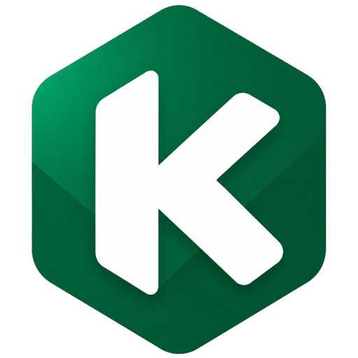

<div align="center">
  

  # Página Web

  **Sitio web corporativo de Kadabra**

  
  
  
  

</div>

---

## Acerca del proyecto

Kadabra WebPage es el sitio corporativo de **Kadabra**, empresa de desarrollo de software a medida. El sitio está construido con Astro como generador estático, soporta dos idiomas (Español e Inglés) con detección automática del navegador, y tiene tema oscuro/claro persistido en `localStorage`.

Características principales:

- Bilingüe ES / EN con detección automática del idioma del navegador
- Tema oscuro y claro, con paleta de colores inspirada en Supabase
- Selector de idioma y toggle de tema integrados en el navbar
- Fuente Inter Variable con configuración avanzada de `font-feature-settings`
- SEO por página: `<title>` y `<meta description>` únicos en cada ruta
- Sitemap generado automáticamente en `/sitemap-index.xml`
- Página 404 personalizada con link de vuelta al inicio

---

## Estructura del proyecto

```
kadabra/
├── public/
│   ├── favicon.ico
│   └── logo/
│       ├── main-logo.png            # Logo principal de la marca
│       ├── logo-arti.png            # Logo cliente Arti Productos Industriales
│       └── logo-layconsa.png        # Logo cliente Layconsa
│
├── src/
│   ├── components/
│   │   ├── navbar.astro             # Navbar sticky con logo, links, tema e idioma
│   │   ├── hero.astro               # Sección hero de la homepage
│   │   ├── footer.astro             # Footer con redes sociales y contacto
│   │   ├── tech-belt.astro          # Carrusel animado de tecnologías (21 iconos SVG)
│   │   ├── icons/
│   │   │   ├── whatsapp-icon.astro  # Icono SVG de WhatsApp reutilizable
│   │   │   ├── illustration-development.astro   # Ilustración SVG: Desarrollo a medida
│   │   │   ├── illustration-integrations.astro  # Ilustración SVG: Integraciones
│   │   │   ├── illustration-maintenance.astro   # Ilustración SVG: Mantenimiento
│   │   │   ├── illustration-consulting.astro    # Ilustración SVG: Consultoría
│   │   │   └── tech/                # 21 iconos SVG de tecnologías (simple-icons)
│   │   │       ├── icon-csharp.astro, icon-dotnet.astro, icon-swagger.astro
│   │   │       ├── icon-javascript.astro, icon-typescript.astro, icon-nodejs.astro
│   │   │       ├── icon-nextjs.astro, icon-astro.astro, icon-tailwind.astro
│   │   │       ├── icon-nestjs.astro, icon-express.astro, icon-python.astro
│   │   │       ├── icon-django.astro, icon-kotlin.astro, icon-dart.astro
│   │   │       ├── icon-flutter.astro, icon-mysql.astro, icon-postgresql.astro
│   │   │       └── icon-sqlserver.astro, icon-aws.astro, icon-azure.astro
│   │   └── ui/
│   │       ├── form-input.astro     # Input reutilizable con label y validación
│   │       ├── form-select.astro    # Select reutilizable con label y validación
│   │       └── form-textarea.astro  # Textarea reutilizable con label y validación
│   │
│   ├── i18n/
│   │   ├── es.json                  # Textos en español (todas las páginas + SEO)
│   │   └── en.json                  # Textos en inglés (todas las páginas + SEO)
│   │
│   ├── layouts/
│   │   └── main-layout.astro        # Shell HTML, head (SEO), script de tema, navbar, footer
│   │
│   ├── lib/
│   │   └── i18n.ts                  # getLangFromUrl() y getTranslations()
│   │
│   ├── pages/
│   │   ├── index.astro              # Redirect raíz → idioma del navegador
│   │   ├── 404.astro                # Página de error 404 personalizada y bilingüe
│   │   └── [lang]/
│   │       ├── index.astro          # Homepage: hero, tech belt, servicios, clientes
│   │       ├── contacto.astro       # Página de contacto con formulario Web3Forms
│   │       ├── servicios.astro      # Página de servicios con ilustraciones SVG
│   │       └── sobre-nosotros.astro # Sobre Nosotros: misión, visión, valores, proceso
│   │
│   └── styles/
│       └── global.css               # Tailwind v4, @theme, variables CSS, animaciones
│
├── astro.config.mjs                 # Config Astro: site, i18n, sitemap, trailingSlash
├── tsconfig.json
└── package.json
```

---

## Flujo de la aplicación

### Detección de idioma

```
Usuario visita /
       │
       ▼
index.astro (script cliente)
       │
       ├─ navigator.language empieza con "es"? ──► redirect a /es
       │
       └─ cualquier otro idioma ──────────────────► redirect a /en
```

La ruta raíz `/` no renderiza contenido — solo ejecuta un script `is:inline` que lee `navigator.language` y redirige inmediatamente.

### Resolución de ruta e idioma

```
URL: /es  o  /en  o  /es/contacto  o  /en/contacto
               │
               ▼
    [lang]/index.astro  |  [lang]/contacto.astro
               │
               ▼
    getLangFromUrl(url)  ──►  extrae "es" o "en" del pathname
               │
               ▼
    getTranslations(lang)  ──►  importa es.json o en.json (import estático, HMR activo)
               │
               ▼
    Renderiza página con textos del idioma correspondiente
```

### Envío del formulario de contacto

```
Usuario completa el formulario y hace submit
       │
       ▼
fetch POST → https://api.web3forms.com/submit
       │
       ├─ json.success === true ──► muestra mensaje de éxito + resetea el formulario
       │
       └─ error de red o API  ──► muestra mensaje de error
```

El formulario incluye un honeypot anti-spam (`botcheck`) y un `access_key` que identifica la cuenta de Web3Forms.

### Tema oscuro / claro

```
Carga de página
      │
      ▼
main-layout.astro → <script is:inline> en <head>
      │
      ├─ localStorage.getItem("theme")  existe? ──► aplica ese valor
      │
      └─ no existe ──► prefers-color-scheme del SO/browser
                          ├─ dark  ──► aplica "dark"
                          └─ light ──► aplica "light"
      │
      ▼
document.documentElement.classList.add("dark" | "light")
      │
      ▼
Click en toggle de tema (navbar)
      │
      ▼
classList.toggle("dark")  +  localStorage.setItem("theme", ...)
```

### Cambio de idioma

```
Click en ES o EN (navbar)
         │
         ▼
href calculado server-side en navbar.astro:
  currentPath.replace(`/${lang}`, "/es" | "/en")

Ejemplo: /en/contacto  ──►  /es/contacto
         │
         ▼
Astro genera la nueva ruta estática con el JSON del idioma elegido
```

---

## Cómo levantar el proyecto

### Requisitos

- Node.js `>= 22.12.0`
- npm

### Instalación

```bash
git clone https://github.com/cristhian-apaza/kadabra.git
cd kadabra
npm install
```

### Desarrollo

```bash
npm run dev
```

Abre [http://localhost:4321](http://localhost:4321) — redirige automáticamente según el idioma del navegador.

### Build de producción

```bash
npm run build
npm run preview   # previsualiza el build estático
```

---

## Autores

| Autor | Rol |
|-------|-----|
| [Cristhian Apaza](https://github.com/cristhian-apaza) | Fundador & Developer |
| [GitHub Copilot](https://github.com/features/copilot) — Claude Sonnet 4.6 | AI Pair Programmer |
